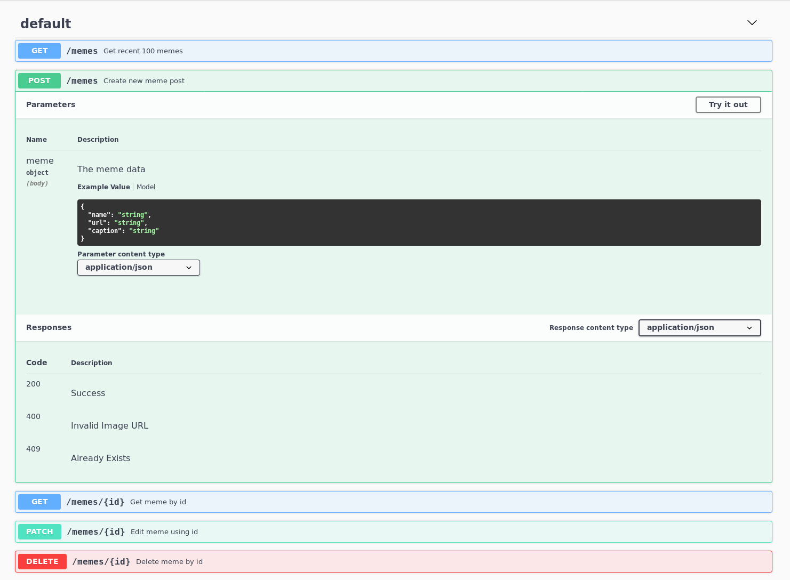

# 🐶 [Meme Stream App](https://meme-stream-app.herokuapp.com/) 🐶

_As a part of Crio Winter of Doing Stage 2B_
***
PostgreSQL Express React Node (PERN) full-stack app for posting and viewing _Memes_, integrates React frontend with Node.js backend. 

***Note: to open web links in a new window use: _ctrl+click on link_***

## :page_facing_up: Table of contents

* [General info](#general-info)
* [Screenshots](#screenshots)
* [Technologies](#technologies)
* [Setup](#setup)
* [Code Samples](#code-samples)
* [Features](#features)
* [Status and To-do](#status)
* [Deployment](#deployment)

## :books: <span id = "general-info">General info<span>

### Backend

* PostgreSQL needs to be installed and running - I installed it from the debian repository and configured in psql
* Swagger used to test the backend before frontend was available
* Postgresql shell commands: `\l` list all databases. `\c database1` connect to database1. `\dt` inspect tables. `\q` to quit.

### Frontend

* React frontend includes a form component with name, caption and url input fields.
* [Create React App](https://reactjs.org/docs/create-a-new-react-app.html#create-react-app) was used for the frontend.

## :camera: <span id = "screenshots">Screenshots</span>

* Swagger UI


* App Front-End


## :signal_strength: <span id = "technologies">Technologies</span> - Backend

* [PostgreSQL v13.1](https://www.postgresql.org/)
* [Express.js middleware v4.17.1](https://expressjs.com/)
* [Node.js v12.20.1](https://nodejs.org/es/)
* [Nodemon](https://www.npmjs.com/package/nodemon) npm module so backend server will automatically restart after code changes

## :signal_strength: Technologies - Frontend

* [React framework v17.0.1](https://reactjs.org/)
* [Create React App](https://reactjs.org/docs/create-a-new-react-app.html#create-react-app) used to bootstrap frontend React app
* [Bootstrap v4](https://getbootstrap.com/) component library

## :floppy_disk: <span id = "setup">Setup</span> - Backend

* Give executable permissions to the all the scripts as `$ chmod +x <script_name>`
* Run `insall.sh` to install and setup the package dependencies eg, node, npm, postgresql.
* Run `server_run` to install the npm dependencies and run the server for the first time.
* Now every time you want to run the server run `npm run dev`

## :floppy_disk: Setup - Frontend

* `cd \client`
* Run `yarn install` to install all the project dependencies
* Run `yarn start` to start development server.

## :computer: <span id = "code-samples">Code Examples</span> - Backend

* [node-fetch](https://www.npmjs.com/package/node-fetch) and [request-image-size](https://www.npmjs.com/package/request-image-size) npm packages used to validate the image url.

```javascript
const validateImageUrl = async (url) => {
    let isImage;

    // Fetching for checking header Content-Type : image/*
    await fetch(url)
        .then((response) => {
            if(((response.headers.raw()['content-type'][0]).match(/(image)+\//g)).length != 0){
                isImage = true;        
            } else {
                isImage = false;
            }
        }).catch((error) => {
            isImage = false;
        });

    // Requesting Size of the image just in case headers were wrong
    await requestImageSize(url)
        .then(size => {
            isImage = true;
        })
        .catch(err => {
            isImage = isImage || false;
        });
    
    return isImage;
}
```

## :computer: Code Examples - Frontend

* Method to Edit a meme.

```javascript
// Patching the meme
response = await fetch(`/memes/${this.props.id}`,{
    method: "PATCH",
    headers: {"Content-Type": "application/json"},
    body: JSON.stringify({
        "url": this.state.url,
        "caption":  this.state.caption
    })
});
```

## :cool: <span id = "features">Features</span> - Backend

* All data stored in PostgreSQL database that can also be viewed and changed from the PostgreSQL shell (psql)
* The Image URL is validated in the backend to avoid issues further.
* **Swagger UI** runs on `http://localhost:8080/swagger-ui/` in development and is extremely useful for testing and documenting the APIs.

## :cool: Features - Frontend

* Implemented [Lazy Loading](https://en.wikipedia.org/wiki/Lazy_loading) for images using [react-lazy-load-image-component](https://www.npmjs.com/package/react-lazy-load-image-component) which significantly increased the performance of the web application.
* React app created from the command prompt using [Create React App](https://reactjs.org/docs/create-a-new-react-app.html#create-react-app)
* [Bootstrap 4 Modal](https://www.w3schools.com/bootstrap4/bootstrap_modal.asp) used for edit window.

## :clipboard: <span id = "status">Status</span> & To-Do List

* Status: Working front and back ends. App works and stores Memes in PostgreSQL database. Deploy to Heroku working.
* To-Do (After Evaluation): 
    - Add Authentication to Ensure correct Edit and Delete permissions (Currently deletion is only possible with the use of master password) 
    - Add feature to detect and delete/stop NSFW content, using an external API.

## :rocket: <span id = "deployment">Deployment</span>

* Production Build of Front-End is served using express static.

```javascript
if(process.env.NODE_ENV === "production") {
    //Rendering Static Client Side
    app.use(express.static("./client/build"));

    // Swagger Docs
    app.use("/api-docs", swaggerUI.serve, swaggerUI.setup(swaggerDocs));
}
```

* Deployed the Full Application (Both Client and Server) on [**heroku**](https://www.heroku.com/). 

    - _URL_: https://meme-stream-app.herokuapp.com/

* API Calls can be made from the `/memes` endpoint.
    - _URL_: https://meme-stream-app.herokuapp.com/memes

* Swagger UI is running on `/api-docs`.
    - _URL_: https://meme-stream-app.herokuapp.com/api-docs/


